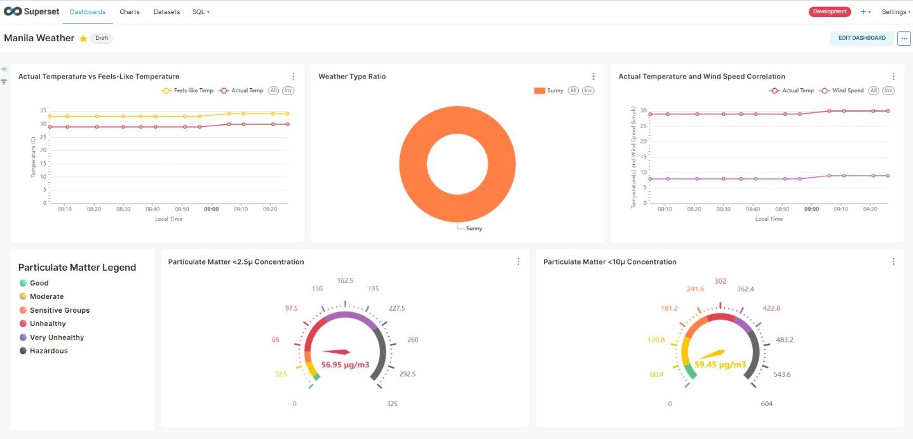
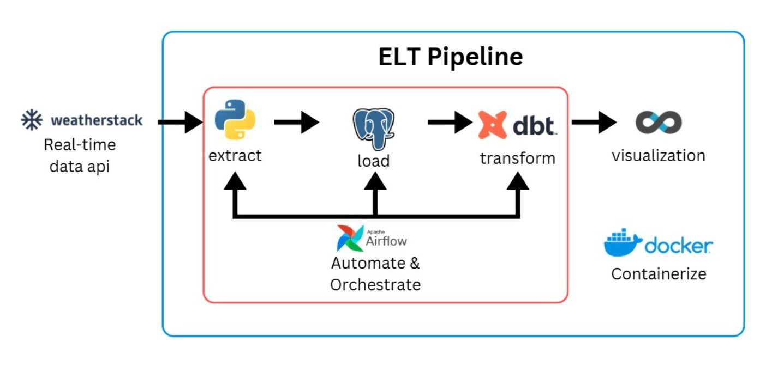

# Weather Data Project / Automated ELT Pipeline
 
## Manila Weather Dashboard Screenshot

Screenshot is taken approximately ~1 hour runtime. Live data is fetched and dashboard is refreshed at 5 minute intervals. 

Dashboard containing 5 main widgets: 
- Actual temperature vs feels like temperature - visualize the gap between the actual temp and perceived temp.
- Weather type ratio: show which weather description is most common throughout the day.
- Actual temperature and wind speed correlation - examine whether actual temperature and wind speed have any substantial relationship.
- Particulate Matter 2.5 and 10 -  a gauge chart showing the latest reading for particulate concentration and highlights the safety level.

## End-to-end ELT Pipeline

For this project, Docker is used to create containers for the dbt, postgresql, airflow and superset. 
The real-time data is sourced from weatherstack and is fetched using weatherstack api through python. Loaded the raw data into the PostgreSQL database. Utilized DBT to create staging and modelling files to isolate, prepare and structure the raw data to be presentable on a dashboard through superset. DAGS on Apache-Airflow were then created to automate fetching, ingesting, and transforming the data at 5 minute intervals. There is 1 DAG with two tasks, one is to simply trigger the python script that fetches the data from Weatherstack and ingests it into the PostgreSQL database. The second task triggers the DBT functions which are the stg_weather_data.sql which does preliminary data cleaning such as removing duplicate records; and hands it over to the modeling files setup which are customized depending on the visualization being created.

Complete tech stack for the project:
- Environment: WSL Ubuntu distro
- Language: Python
- Containerization: Docker
- Database: PostgreSQL
- Transformation: DBT
- API: Weatherstack
- Automation and Orchestration: Apache-Airflow
- Visualization: Apache-Superset

## Project Structure
Each containerized application(airflow, dbt, postgres, docker) were given their own folders in order to cleanly mount local files to the container file directories. 
- airflow contains the dags folder which houses the orchestrator.py file which handles the automation and triggering of the python scripts, PostgreSQL, and dbt models.
- api-request houses the python scripts that handle fetching the data from Weatherstack and interfacing with PostgreSQL in order to create the tables and schema on first run, and to insert the respective records.
- dbt mainly contains the modeling files that prepare the raw data.
- docker contains the Apache-Superset configuration and setup files to allow it to communicate with the rest of the pipeline.
- postgres contains the database initialization files, in this repository are replaced with .example versions, which establishes the basic database details such as the user, password and database name.
- Lastly, the docker-compose.yaml file is the configuration and setup for all of the containerized applications and allows all of the apps to interface with each other and be able to pass data to everything.
